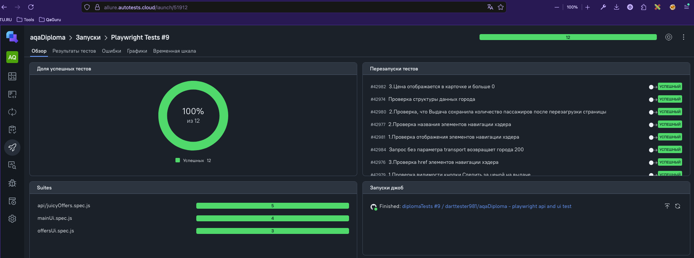
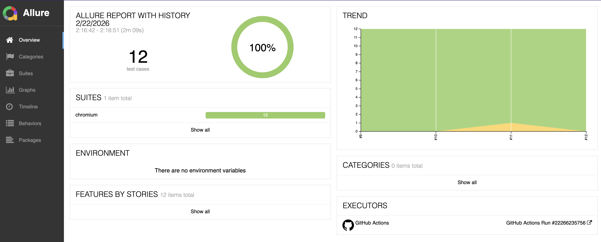
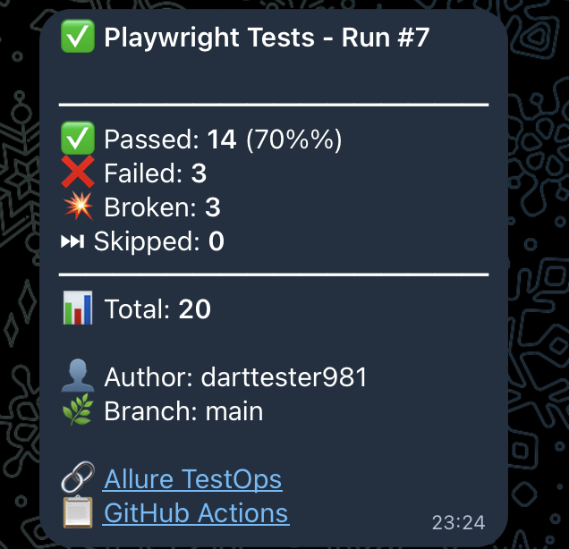

# 🎯 Дипломная работа по автоматизации тестирования

## 📑 Описание работы

Данный репозиторий содержит дипломный проект, выполненный в рамках курса автоматизации тестирования. Работа демонстрирует полученные навыки разработки и внедрения автотестов для веб-приложений и RESTful API.

В качестве объекта тестирования используется:

* **tutu.ru** - крупнейший российский сервис онлайн-бронирования билетов на транспорт

Проект включает в себя следующие особенности:

* UI-тесты с использованием Page Object Model
* API-тесты с использованием Service слоя
* Генерация тестовых данных с помощью Faker.js
* Использование Custom Fixtures для упрощения тестов
* Применение архитектурных паттернов (Facade, Barrel pattern)
* CI/CD интеграция через GitHub Actions
* Генерация Allure-отчетов с сохранением истории
* Интеграция с Allure TestOps
* Уведомления с отчетами о выполнении тестов через бота в Telegram

## 🛠 Технологический стек

- **JavaScript** — язык программирования для написания автоматизированных тестов
- **Playwright** — фреймворк для кросс-браузерного тестирования веб-приложений
- **Faker.js** — библиотека для генерации тестовых данных
- **GitHub** — платформа для хранения кода и совместной разработки
- **GitHub Actions** — инструмент CI/CD для автоматизации процессов тестирования
- **Allure Report** — система визуализации результатов тестирования
- **Allure TestOps** — система управления тестами и отчетами
- **Telegram** — мессенджер для автоматического информирования о результатах тестов


## 📁 Структура проекта

```
aqaDiploma/
├── .github/
│   └── workflows/
│       └── main.yml              # CI/CD pipeline
├── src/
│   ├── app.js                    # Facade класс (архитектурный слой)
│   ├── components/
│   │   ├── header.component.js   # Page Object для хэдера
│   │   └── index.js              # Barrel export
│   ├── pages/
│   │   ├── main.page.js          # Page Object главной страницы
│   │   ├── mainSearch.page.js    # Page Object поиска
│   │   ├── aviaOffers.page.js    # Page Object страницы предложений
│   │   └── index.js              # Barrel export
│   ├── services/
│   │   └── juicyOffers.service.js # Service для API тестов
│   └── helpers/
│       ├── fixtures/
│       │   └── fixture.js        # Custom Playwright fixtures
│       ├── flightSearch.generator.js # Генератор тестовых данных
│       └── price.helper.js       # Хелперы для работы с ценами
├── tests/
│   ├── mainUi.spec.js            # UI тесты главной страницы
│   ├── offersUi.spec.js          # UI тесты страницы предложений
│   └── api/
│       └── juicyOffers.spec.js   # API тесты
├── media/
│   └── screenshots/              # Скриншоты для документации
├── playwright.config.mjs         # Конфигурация Playwright
└── package.json                  # Зависимости проекта
```

## 🚀 Установка

### Клонировать репозиторий на локальную машину:
```bash
git clone https://github.com/darttester981/aqaDiploma.git
cd aqaDiploma
```

### Установка зависимостей:
```bash
npm install
```

### Установка браузеров Playwright:
```bash
npx playwright install --with-deps
```

## ▶️ Запуск тестов

### Запуск всех тестов:
```bash
npm test
```

### Запуск только UI тестов:
```bash
npx playwright test tests/mainUi.spec.js tests/offersUi.spec.js
```

### Запуск только API тестов:
```bash
npx playwright test tests/api/
```

### Запуск в UI режиме:
```bash
npx playwright test --ui
```

### Запуск с headed браузером:
```bash
npx playwright test --headed
```

## 📊 Отчеты

### Генерация Allure отчета локально:
```bash
# После запуска тестов
npx allure generate allure-results --clean -o allure-report

# Открыть отчет
npx allure open allure-report
```

### Просмотр HTML отчета Playwright:
```bash
npx playwright show-report
```

## 🎯 Тестовые сценарии

### UI Тесты (mainUi.spec.js):
- Проверка отображения элементов навигации
- Проверка текста и ссылок навигации
- Проверка валидации формы поиска
- Проверка поведения тултипов

### UI Тесты (offersUi.spec.js):
- Проверка элементов страницы предложений
- Проверка сохранения параметров поиска
- Проверка отображения цен

### API Тесты (juicyOffers.spec.js):
- Получение списка городов для разных типов транспорта
- Проверка структуры ответа API
- Тесты с использованием генератора данных
- Валидация обязательных полей

## 🤖 CI/CD через GitHub Actions

Автоматизированные тесты запускаются при каждом push в ветку `main` или могут быть запущены вручную.

### Workflow включает:
1. ✅ Установку зависимостей
2. ✅ Установку браузеров
3. ✅ Запуск всех тестов
4. ✅ Генерацию Allure отчета
5. ✅ Публикацию отчета на GitHub Pages (с историей)
6. ✅ Отправку результатов в Allure TestOps
7. ✅ Уведомления в Telegram со статистикой

### Ссылка на GitHub Actions:
```
https://github.com/darttester981/aqaDiploma/actions
```

### Ссылка на Allure Report (с историей):
```
https://darttester981.github.io/aqaDiploma/
```

## 📈 Allure TestOps

Результаты всех запусков автоматически отправляются в Allure TestOps для централизованного управления тестами и анализа результатов.

### Возможности:
- История запусков с трендами
- Детальная информация по каждому тесту
- Вложения (скриншоты, видео, трейсы)
- Аналитика и дашборды
- Интеграция с Jira



## 📊 Allure Report

Allure Report генерируется после каждого запуска и публикуется на GitHub Pages с сохранением истории предыдущих запусков.

### Основные разделы отчета:
- **Overview** — общая статистика и графики
- **Suites** — группировка тестов по наборам
- **Graphs** — визуализация результатов
- **Timeline** — хронология выполнения тестов
- **Behaviors** — группировка по фичам



## 📱 Уведомления в Telegram

После завершения тестов бот в Telegram автоматически отправляет сообщение с результатами:

### Сообщение содержит:
- ✅ Количество успешных тестов
- ❌ Количество упавших тестов
- 💥 Количество сломанных тестов
- ⏭ Количество пропущенных тестов
- 📊 Общая статистика и процент успеха
- 👤 Автор коммита
- 🌿 Ветка
- 🔗 Ссылки на Allure Report и Allure TestOps



## 🎨 Архитектурные решения

### Page Object Model (POM)
Все взаимодействия с UI инкапсулированы в Page Objects:
- `MainPage` - главная страница
- `MainSearch` - форма поиска билетов
- `AviaOffersPage` - страница с предложениями
- `HeaderComponent` - компонент хэдера

### Service Layer
API запросы инкапсулированы в Service классы:
- `JuicyOffersService` - работа с API поиска городов

### Facade Pattern
Класс `App` объединяет все Page Objects для удобного доступа:
```javascript
const app = new App(page);
await app.mainPage.open('/');
await app.mainSearch.searchFlights(data);
```

### Custom Fixtures
Playwright fixtures для упрощения тестов:
```javascript
test('Example', async ({ app }) => {
  await app.mainSearch.fillRoute(data);
});
```

### Data Generation
Использование Faker.js для генерации тестовых данных:
- `generateFlightSearchData()` - данные для поиска билетов
- `generateTransportType()` - случайный тип транспорта

## 📝 Требования диплома

### ✅ UI Тесты:
- [x] Использование Page Object Model
- [x] Использование генератора данных
- [x] Проверка различных элементов UI
- [x] Валидация форм

### ✅ API Тесты:
- [x] 5 функциональных тестов
- [x] Использование Service слоя
- [x] Использование генератора данных
- [x] Проверка структуры ответов
- [x] Проверка статус-кодов

### ✅ Reporting:
- [x] Подключен Allure с сохранением истории в GitHub Pages
- [x] Результаты передаются в Allure TestOps
- [x] Скриншоты Allure Report и TestOps в README

### ✅ CI/CD:
- [x] GitHub Actions workflow
- [x] Автоматический запуск при push
- [x] Уведомления в Telegram

## 👤 Автор

**Давыдов Даниил**

GitHub: [@darttester981](https://github.com/darttester981)

---

## 📚 Полезные ссылки

- [Playwright Documentation](https://playwright.dev/)
- [Allure Report Documentation](https://docs.qameta.io/allure/)
- [Allure TestOps](https://qameta.io/allure-testops/)
- [Faker.js Documentation](https://fakerjs.dev/)

---
